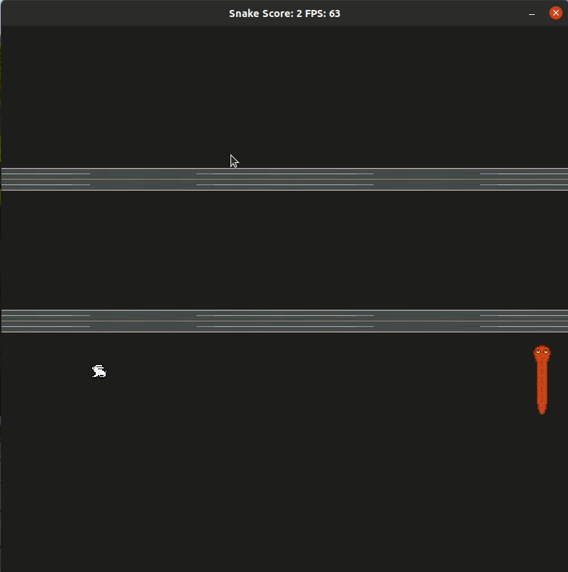

# Snake-Crossing Game Project

This is a repo for the Capstone project submission in the [Udacity C++ Nanodegree Program](https://www.udacity.com/course/c-plus-plus-nanodegree--nd213). The provided templated code was modified and extended with texture rendering offered by SDL2 library.

---
## Expected Behavior

## Dependencies for Running Locally
* cmake >= 3.7
  * All OSes: [click here for installation instructions](https://cmake.org/install/)
* make >= 4.1 (Linux, Mac), 3.81 (Windows)
  * Linux: make is installed by default on most Linux distros
  * Mac: [install Xcode command line tools to get make](https://developer.apple.com/xcode/features/)
  * Windows: [Click here for installation instructions](http://gnuwin32.sourceforge.net/packages/make.htm)
* SDL2 >= 2.0
  * All installation instructions can be found [here](https://wiki.libsdl.org/Installation)
  * Note that for Linux, an `apt` or `apt-get` installation is preferred to building from source.
* gcc/g++ >= 5.4
  * Linux: gcc / g++ is installed by default on most Linux distros
  * Mac: same deal as make - [install Xcode command line tools](https://developer.apple.com/xcode/features/)
  * Windows: recommend using [MinGW](http://www.mingw.org/)

## Basic Build Instructions

1. Clone this repo.
2. Make a build directory in the top level directory: `mkdir build && cd build`
3. Compile: `cmake .. && make`
4. Run it: `./SnakeGame`.

## Capstone Project Rubric

Following described rubric points addressed.

### 1. README (All Rubric Points REQUIRED)

* A README with instructions is included with the project [x]
* The README indicates which project is chosen [x]
* The README includes information about each rubric point addressed [x]

### 2. Compiling and Testing (All Rubric Points REQUIRED)

* The submission must compile and run [x]

### 3. Loops, Functions, I/O

* The project demonstrates an understanding of C++ functions and control structures [x]
    * renderer.cpp line 89 - 166
* The project reads data from a file and process the data, or the program writes data to a file [x]
    * mixer.cpp line 16, renderer.cpp line 60 - 61
* The project accepts user input and processes the input [x]
    * controller.cpp line 12 - 41

### 4. Object Oriented Programming

* The project uses Object Oriented Programming techniques [x]
* Classes use appropriate access specifiers for class members [x]
* Class constructors utilize member initialization lists [x]
* Classes abstract implementation details from their interfaces [x]
* Classes encapsulate behavior [x]
* Classes follow an appropriate inheritance hierarchy [x]
    * texture.h
* Overloaded functions allow the same function to operate on different parameters []
* Derived class functions override virtual base class functions [x]
    * texture.h line 28 & 36
* Templates generalize functions in the project []

### 5. Memory Management

* The project makes use of references in function declarations [x]
    * game.h line 14 - 15
* The project uses destructors appropriately [x]
    * texture.cpp line 7, mixer.cpp line 12
* The project uses scope / Resource Acquisition Is Initialization (RAII) where appropriate []
* The project follows the Rule of 5 []
* The project uses move semantics to move data, instead of copying it, where possible []
* The project uses smart pointers instead of raw pointers [x]
    * renderer.h line 31 - 32

### 6. Concurrency

* The project uses multithreading []
* A promise and future is used in the project []
* A mutex or lock is used in the project []
* A condition variable is used in the project []

#### Credits

 * snake sprites and sound effects made by eugeneloza: https://opengameart.org/content/snake-sprites-sound
 * car sprites taken from https://ipixl.itch.io/city-cars
